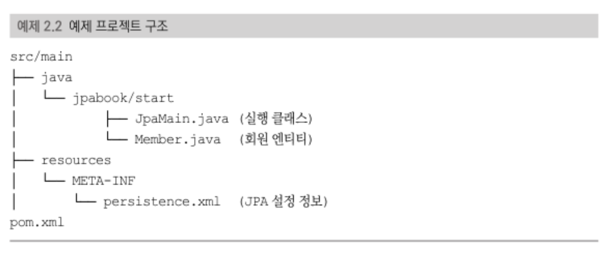
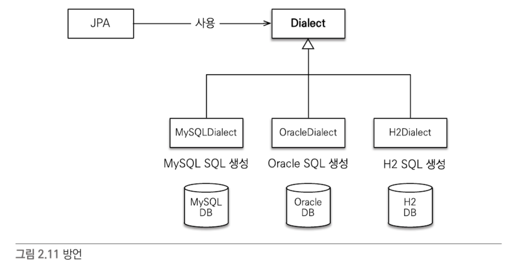
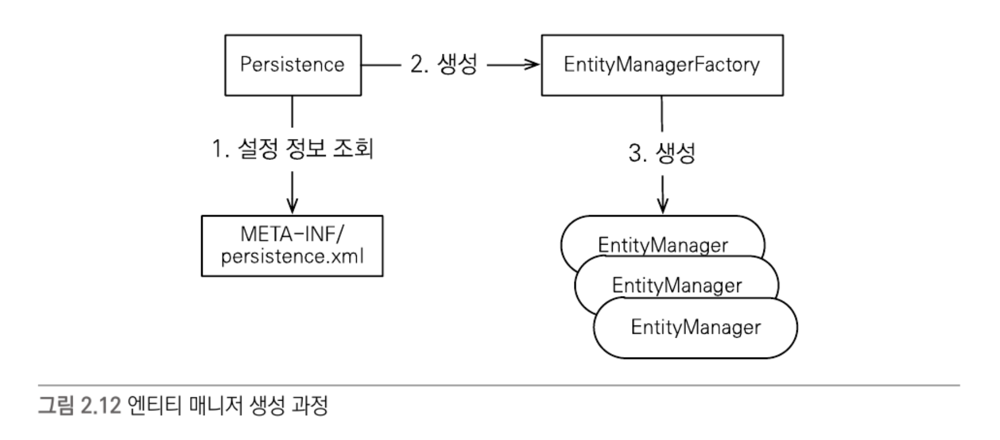

# JPA 시작
## 라이브러리와 프로젝트 구조


## 객체 매핑
+ @Entity : 이 클래스를 테이블과 매핑한다고 JPA에게 알려준다.
+ @Table(name = "테이블이름") : 엔티티 클래스에 매핑할 테이블 정보를 알려준다.
+ @Id : 해당 필드를 테이블의 기본 키에 매핑한다.
+ @Column(name = "컬럼이름") : 필드를 컬럼에 매핑한다.

## persistence.xml 설정
JPA는 persistence.xml을 사용해서 필요한 설정 정보를 관리한다. 이 설정 파일이 `META-INF/persistence.xml` 클래스 패스 경로에 있으면 별도의 설정 없이 JPA가 인식할 수 있다.

### JPA 표준 설정
+ javax.persistence.jdbc.driver : JDBC 드라이버 
+ javax.persistence.jdbc.user : 데이터베이스 접속 아이디 
+ javax.persistence.jdbc.password : 데이터베이스 접속 비밀번호
+ javax.persistence.jdbc.url : 데이터 베이스 접속 url
### 하이버네이트 속성
+ hibernate.dialect : 데이터베이스 방언 설정
+ hibernate.show_sql : 하이버네이트가 실행한 SQL을 출력 
+ hibernate.format_sql : 하이버네이트가 실행한 SQL을 출력할 때 보기 좋게 정렬
+ hibernate.use_sql_comments : 쿼리를 출력할 때 주석도 출력 
+ hibernate.id.new_generator_mappings : JPA 표준에 맞춘 새로운 키 생성 전략을 사용한다.

### 데이터베이스 방언

개발자는 JPA가 제공하는 표준 문법에 맞춰 JPA를 사용하면 되고, 특정 데이터베이스에 의존적인 SQL은 데이터베이스 방언이 처리해준다. 따라서 데이터베이스가 변경되어도 애플리케이션 코드를 변경할 필요 없이 데이터베이스 방언만 교체하면 된다.
#### 종류 
+ H2 : org.hibernate.dialect.H2Dialect
+ Oracle 10g : org.hibernate.dialect.Oracle10gDialect
+ MySQL : org.hibernate.dialect.MySQL5InnoDBDialect

## 애플리케이션 개발
### 엔티티 매니저 설정

#### 엔티티 매니저 팩토리 생성
```java
EntityManagerFactory emf = Persistence.createEntityManagerFactory("jpabook");
```
+ `META-INF/persistence.xml`에서 이름이 `jpabook`인 영속성 유닛을 찾아서 엔티티 매니저 팩토리를 생성한다.
+ 생성 시 persistence.xml 정보를 읽어 JPA를 동작시키기 위한 객체를 만들고 JPA 구현체에 따라서는 데이터베이스 커넥션 풀을 생성한다.
+ 엔티티 매니저 팩토리를 생성하는 비용은 크기에 애플리케이션 전체에서 딱 한 번만 생성하고 공유해서 사용해야 한다.

#### 엔티티 매니저 생성
```java
EntityManager em = emf.createEntityManager(); //엔티티 매니저 생성
```
+ JPA의 기능 대부분은 엔티티 매니저가 제공한다.
+ 엔티티 매니저를 사용해서 엔티티를 데이터베이스에 CRUD 할 수 있다.
+ 엔티티 매니저는 내부에 데이터 소스(데이터베이스 커넥션)를 유지하면서 데이터베이스와 통신한다.
+ 엔티티 매니저는 데이터베이스 커넥션과 밀접한 관계가 있으므로 스레드간에 공유하거나 재사용하면 안된다.

#### 종료
```java
em.close(); // 엔티티 매니저 종료
emf.close(); //엔티티 매니저 팩토리 종료
```
+ 사용이 끝난 엔티티 매니저는 반드시 종료해야 한다.
+ 애플리케이션을 종료할 때 엔티티 매니저 팩토리를 종료해야 한다.

### 트랜잭션 관리
+ JPA를 사용하면 항상 트랜잭션 안에서 데이터를 변경해야 한다. 트랜잭션 없이 데이터를 변경할 시 예외가 발생한다.
+ 트랜잭션을 시작하려면 엔티티 매니저에서 트랜잭션 API를 받아와야 한다.
+ 트랜잭션 API를 사용해서 비즈니스 로직이 정상 동작하면 트랜잭션을 커밋하고 예외가 발생하면 트랜잭션을 롤백한다.

### 비즈니스 로직
+ 등록 : 엔티티 매니저의 `persist()` 메소드에 저장할 엔티티를 넘겨주면 된다.
+ 수정 : JPA는 어던 엔티티가 변경되었는지 추적하는 기능을 갖추고 있기에 `member.setAge(20)` 처럼 엔티티 값만 변경함녀 된다.
+ 삭제 : 앤티티 매니저의 `remove()` 메소드에 삭제하려는 엔티티를 넘겨주면 된다.
+ 한 건 조회 : `find(엔티티타입.class, 기본키와 매핑한 식별자 값)` 으로 조회 가능하다.

### JPQL
+ JPA는 SQL을 추상화한 JPQL(Java Persistence Query Language)이라는 객체지향 쿼리 언어를 제공한다. 
+ SQL은 데이터베이스 테이블을 대상으로 쿼리하는 반면 JPQL은 엔티티 객체를 대상으로 쿼리한다.
+ JPQL을 사용하려면 엔티티 매니저의 `createQuery(JPQL, 반환타입)` 메소드를 실행해서 쿼리 객체를 생성한 후 쿼리 객체의 `getResultList()` 메소드를 호출하면 된다.