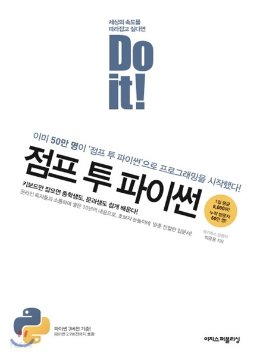
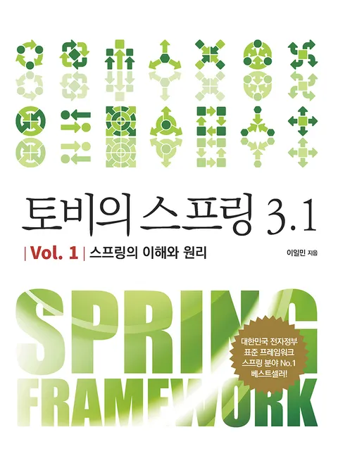

# 📔공부 기록
책을 읽고 책에 있는 내용을 요약해서 정리하거나, 강의를 듣고 강의 내용을 정리합니다.

 

## 📖BOOKS
<table>
  <thead>
    <tr>
      <th align=center>
        <a href="https://github.com/CastleSilver/Study_Record/tree/main/Java-Standard">자바의 정석</a>
      </th>
      <th align=center>
        <a href="https://github.com/CastleSilver/Study_Record/tree/main/Jump-to-Python">Do it! Jump to Python</a>
      </th>
      <th align=center>
        <a href="https://github.com/CastleSilver/Study_Record/tree/main/Spring5">스프링5 프로그래밍 입문</a>
      </th>
    </tr>
  </thead>
  <tbody>
    <tr>
      <td align="center">
        
      </td>
      <td align="center">
        
      </td>
      <td align="center">
        
      </td>
    </tr>
    <tr>
      <td align=center>
        <a href="https://github.com/CastleSilver/Study_Record/tree/main/Toby-Spring">토비의 스프링 3.1</a>
      </td>
      <td align=center>
        <a href="https://github.com/CastleSilver/Study_Record/tree/main/JPA_Programming">JPA 프로그래밍 </a>
      </td>
      <td align=center>
        
      </td>
    </tr>
    <tr>
      <td align="center">
        
      </td>
      <td align="center">
        
      </td>
      <td align="center">
        
      </td>
    </tr>
  </tbody>
</table>
 

## 👩‍🏫LECTURES
+ [스프링 핵심 원리 - 기본편 <김영한>](https://github.com/CastleSilver/Study_Record/tree/main/SpringBoot-Basic)
